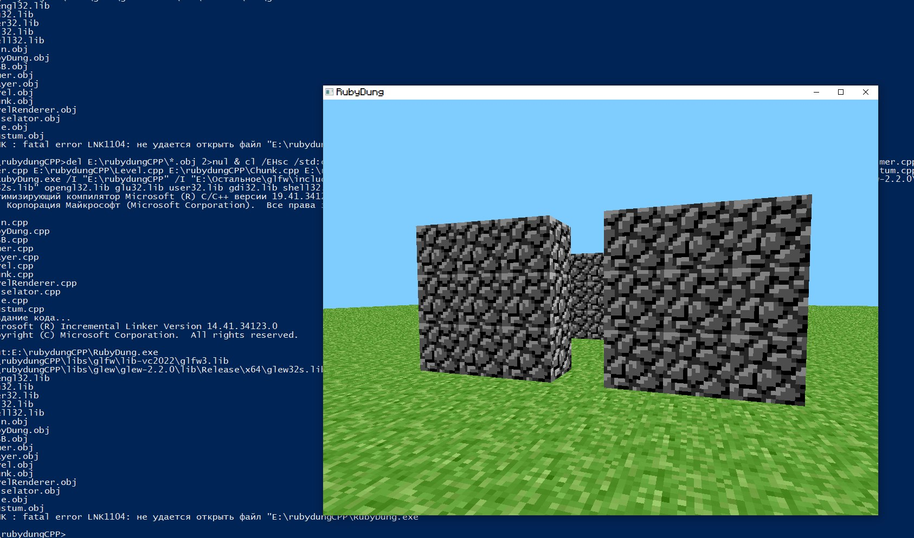

# CppCraft
Minecraft port from Java to C++

This can be useful for creating ports for different consoles and devices that support C++, such as Xbox 360 and PlayStation 3. The port was created using STB_Image, GLEW, and GLFW3. 
